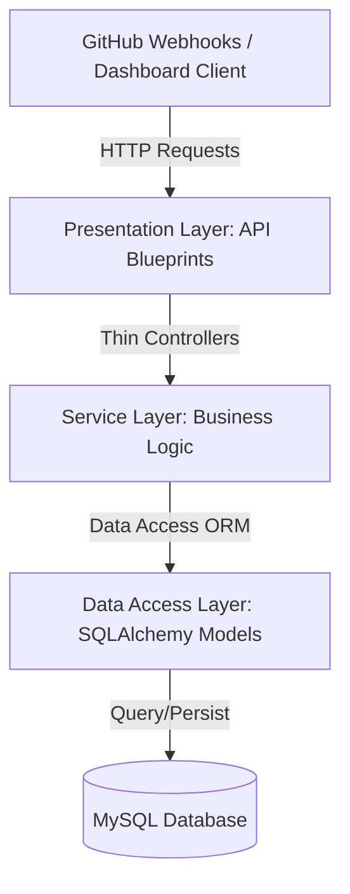

# AI Agent Engineering Rules & Coding Standards Handbook

This document serves as the official rules and engineering standards handbook for the **AI Code Reviewer** codebase. Every AI assistant, agent, or developer contributing to this repository must read, understand, and strictly follow these rules before making any modifications.

---

## 1. Purpose
The purpose of this document is to establish a rigorous, enforceable, and consistent engineering workflow for all AI agents contributing to this project. 
> [!IMPORTANT]
> Every AI agent must read this document, along with [PROJECT.md](file:///d:/MY%20PROJECTS/ai-code-reviewer/docs/PROJECT.md), before modifying, adding, or refactoring code in this repository.

---

## 2. Core Principles
All development in this repository must align with the following core engineering tenets:
* **Production-Grade Engineering**: Code must be robust, secure, tested, and ready for deployment in production environments. No placeholder comments or incomplete implementations.
* **Readability over Cleverness**: Write clean, self-documenting code. Do not use obscure language tricks or compressed logic structures that hinder readability.
* **Maintainability First**: Design modules and functions to facilitate future modifications, testing, and debugging.
* **Simplicity by Design**: Avoid over-engineering. Choose the simplest path that fully satisfies requirements and respects existing architecture.
* **Security by Default**: Implement least privilege access, strict input validation, data sanitization, and signature checks at all system entry points.
* **Backwards Compatibility**: Prevent breaking changes to existing endpoints or database schemas unless explicitly requested and approved.

---

## 3. AI Agent Responsibilities
When assigned a task, every AI agent must execute it under the following operational guidelines:
1. **Understand Current Context**: Inspect and trace existing architecture, dependencies, and imports before proposing or writing code.
2. **Strict Scope Control**: Modify *only* the files directly relevant to the assigned task. Never make ad-hoc, unrelated style changes, or generic refactoring sweeps.
3. **Preserve Functionality**: Ensure all existing endpoints, behaviors, tests, and configurations remain intact and operational.
4. **Explain breaking changes**: If a breaking change is inevitable, document the technical rationale and list affected downstream systems before proceeding.
5. **No Assumptions**: If user intent or technical requirements are ambiguous, stop and ask the user for clarification.

---

## 4. Architecture Rules
This codebase utilizes a layered architecture. Separation of concerns must never be violated.



### Architectural Constraints
* **Application Factory Pattern**: Maintain the setup implemented in [app/__init__.py](file:///d:/MY%20PROJECTS/ai-code-reviewer/app/__init__.py). Never instantiate global extensions bound to a specific application instance.
* **Blueprints**: All endpoints must belong to versioned Flask Blueprints (e.g., [app/api/v1/](file:///d:/MY%20PROJECTS/ai-code-reviewer/app/api/v1/)) and have explicit URL prefixes.
* **Thin Controllers**: API route functions inside blueprints must strictly handle HTTP parsing, parameter validation, invoking the appropriate service class, and returning structured JSON responses. Do not place database queries or business logic inside API routes.
* **Service Layer**: All business logic (Ollama API orchestration, GitHub integration, data transformation) must reside in service classes in [app/services/](file:///d:/MY%20PROJECTS/ai-code-reviewer/app/services/).
* **Extensions Separation**: Declare Flask extensions globally in [app/extensions.py](file:///d:/MY%20PROJECTS/ai-code-reviewer/app/extensions.py). Initialize them inside `create_app()` to prevent circular imports.
* **Zero Circular Imports**: Keep models, blueprints, and services strictly isolated to avoid circular references.

---

## 5. Coding Standards
All Python code written for this project must meet the following criteria:

* **PEP 8 Compliance**: Strictly follow the PEP 8 style guide.
* **Type Hinting**: Provide complete type annotations for all function/method signatures, including parameters and return types.
  ```python
  def fetch_diff(repository: str, pull_request_id: int) -> str:
  ```
* **Meaningful Naming**: Use clear, self-documenting snake_case names for variables, functions, and modules, and PascalCase for classes.
* **Single Responsibility Principle (SRP)**: Keep functions and classes small. If a function is longer than 50 lines, refactor its sub-steps into reusable utility functions.
* **Docstrings**: Document all modules, classes, and public functions with Sphinx or Google-style docstrings explaining purpose, parameters, return types, and exceptions.
* **Magic Numbers & Constants**: Never hardcode configuration strings, magic numbers, or status codes. Declare them as module-level constants or configuration values.

---

## 6. Database Rules
When working with SQLAlchemy and MySQL, obey these guidelines:

* **SQLAlchemy 2.0 Syntax**: Use modern SQLAlchemy 2.0 practices.
  * Use class-based declarative mappings using `Mapped` and `mapped_column` type annotations.
  * Never use legacy querying models (e.g., `Model.query.filter()`). Use `db.session.execute(select(Model).where(...))` instead.
* **Database Modeling Standards**:
  * Define explicit `ForeignKey` constraints with cascading policies (`cascade="all, delete-orphan"` where appropriate).
  * Design tables in Third Normal Form (3NF) unless denormalization is explicitly required.
  * Define indexes on frequently filtered columns (e.g., `github_pr_id`, `created_at`).
* **Migrations**: All database changes must be managed through Flask-Migrate (Alembic) migrations. Never alter tables manually in production database instances.

---

## 7. API Development Rules
* **REST Conventions**: Use correct HTTP methods: `GET` for retrieval, `POST` for creation, `PUT`/`PATCH` for updates, and `DELETE` for removal.
* **HTTP Status Codes**: Return accurate HTTP status codes:
  * `200 OK` (Successful retrieval/update)
  * `201 Created` (Successful creation)
  * `202 Accepted` (Webhook accepted for processing)
  * `400 Bad Request` (Invalid payload/parameters)
  * `401 Unauthorized` (Authentication failures)
  * `403 Forbidden` (Authorization/Permission failures)
  * `404 Not Found` (Resource does not exist)
  * `500 Internal Server Error` (Unhandled system failures)
* **Consistent Payload Format**: All API responses must follow a structured JSON schema:
  ```json
  {
    "status": "success",
    "data": { ... }
  }
  ```
  And for errors:
  ```json
  {
    "status": "error",
    "message": "Detailed description of the error."
  }
  ```

---

## 8. Security Rules
* **Secret Management**: Never hardcode API tokens, keys, passwords, or connection strings. Retrieve them from `config.py`, which reads from `.env` environment variables. Add `.env` to `.gitignore`.
* **HMAC Signature Checks**: All endpoints processing incoming GitHub webhooks must validate the payload using `HMAC-SHA256` signature verification via the `X-Hub-Signature-256` header.
* **Input Validation**: Validate all query parameters, route arguments, and JSON request bodies using standard validations (e.g., Pydantic or Flask-WTF validation helpers).
* **Parameterized Queries**: Never construct raw SQL strings with user input. Always use SQLAlchemy's parameter binding.

---

## 9. Documentation Rules
* **Automatic Updates**: When creating or modifying functions, models, or service classes, update their docstrings immediately.
* **Documentation Manifest**:
  * Reflect database schema modifications in [docs/DATABASE.md](file:///d:/MY%20PROJECTS/ai-code-reviewer/docs/DATABASE.md).
  * Update [docs/ARCHITECTURE.md](file:///d:/MY%20PROJECTS/ai-code-reviewer/docs/ARCHITECTURE.md) when introducing new services or structural patterns.
  * Record release logs, bugfixes, and enhancements in [docs/CHANGELOG.md](file:///d:/MY%20PROJECTS/ai-code-reviewer/docs/CHANGELOG.md).

---

## 10. Testing Rules
* **No Code Without Tests**: Every new endpoint, model, or service class must have corresponding tests inside the [tests/](file:///d:/MY%20PROJECTS/ai-code-reviewer/tests) directory.
* **Mocking External APIs**: Never execute live requests to Ollama API or GitHub API within unit tests. Use `unittest.mock` or mock fixtures to isolate network targets.
* **Regression Testing**: Write targeted regression tests for every bugfix to verify the bug is resolved and cannot reappear.

---

## 11. Git & Version Control Rules
* **Small, Atomic Commits**: Keep commits small and focused. Avoid committing multiple unrelated feature changes at once.
* **Commit Messages**: Follow standard semantic commits guidelines:
  ```
  feat(webhook): implement signature verification logic
  fix(ollama): catch json parsing exception during stream reads
  ```
* **Gitignore Integrity**: Keep configuration files (`.env`), database instances, IDE directories, and cache folders out of the version control workspace.

---

## 12. Performance Rules
* **N+1 Query Prevention**: Avoid executing database select queries in loops. Use joined loads (`joinedload` / `selectinload`) to optimize relational fetching.
* **Connection Pooling**: Configure database pool recycling and connection size limits in production configurations.
* **Profiling**: Profile database and network response times before initiating caching or optimization logic. Avoid premature optimizations.

---

## 13. Error Handling Rules
* **Structured Exceptions**: Define and raise application-specific custom exceptions (inheriting from a base `AppException`) to handle business logic failures.
* **Log Sanitization**: Log warnings and errors via standard logging modules. Never dump plain auth headers, personal access tokens, or raw passwords to log files.
* **User-Facing Messages**: Return generic, polite error messages to the frontend/clients while keeping detailed error stacks inside the internal logging framework.

---

## 14. AI Code Generation Rules
As an AI agent, you must strictly follow these instructions:
1. **No Placeholders**: Never output `// TODO: implement later` or placeholder comments in the final files unless explicitly directed.
2. **Context Integrity**: Respect file structure, directory boundaries, and imports. Do not invent modules or patterns that do not exist.
3. **Exposed Logic**: Document the assumptions, constraints, and dependencies involved in the generated code in your textual responses.

---

## 15. Definition of Done
A development task is marked as **Done** only when it satisfies all checkpoints in the following checklist:

* [ ] The codebase builds successfully without compilation or syntax errors.
* [ ] All tests in the test suite execute and pass.
* [ ] No existing functionality has been degraded or broken.
* [ ] All secret and configuration requirements follow security rules.
* [ ] New or modified modules have accompanying unit tests.
* [ ] Documentation has been updated to reflect the changes (e.g., `CHANGELOG.md`, `ARCHITECTURE.md`).
* [ ] The code is fully typed and adheres to PEP 8 standards.
