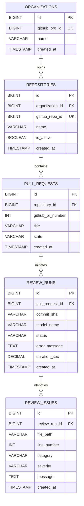

# Database Design Blueprint & Relational Schema Specification

This document provides a production-grade database design specification for the **AI Code Reviewer** system. It serves as the single source of truth for database architecture, normalization logic, schema layout, and indexing strategies. Developers must reference this document when implementing the SQLAlchemy 2.0 ORM layer.

---

## Phase 1: Understand the Business Domain

The **AI Code Reviewer** is an automated auditing system that receives real-time notifications (webhooks) from GitHub, analyzes code changes (diffs) using local LLMs, and publishes automated code quality feedback. 

To enable this workflow, the application must persist information that coordinates GitHub webhook events, code review iterations, and user analytics.

### Information to Store
* **Repositories & Organizations**: Track which codebases are integrated, their connection configurations, and active status.
* **Pull Requests**: State and history of PR events, tracking open branch commits and metadata to handle reviews incrementally.
* **Review Iterations & AI Runs**: Tracks each time a code review is executed, including which AI model was run, system prompt settings, response times, and overall review status.
* **Detailed Inline Comments & Issues**: Store the actual feedback generated (bugs, security risks, linting violations) mapped to specific file paths and line numbers.
* **Metrics & Analytics**: Summarized calculations of review outcomes to support performance visualization dashboards.

### Information NOT to Store
* **Raw Code Repository Copies**: The database must not act as a code storage platform. Code diffs and files should be processed in memory or ephemeral workspaces and immediately discarded after analysis.
* **Unvalidated Webhook Payloads**: Storing raw payload dumps wastes database storage. Extract only parsed metadata.
* **GitHub Private Credentials**: GitHub App Private Keys and tokens must be stored in secure configurations (.env / AWS Secrets Manager) and never written to the relational database.

---

## Phase 2: Identify Business Entities

To model this system, we identify the following core entities:

```
[ Organization ]
       │ (1)
       └───► [ Repository ] (1)
                    │
                    └───► [ PullRequest ] (1)
                                │
                                └───► [ ReviewRun ] (1)
                                             │
                                             └───► [ ReviewIssue ]
```

1. **Organization**: Represents a GitHub organization or user account. It owns repositories and manages general configurations.
2. **Repository**: Represents an individual version-controlled code repository. It acts as the context boundary for Pull Requests.
3. **PullRequest**: Represents a GitHub Pull Request event. It acts as a logical queue of reviews and contains metadata (PR number, head commit, status).
4. **ReviewRun**: Represents a single execution cycle of the AI reviewer. It tracks run metadata, execution times, and target commits.
5. **ReviewIssue**: Represents an individual finding (bug, security risk, warning) generated during a `ReviewRun`. It holds the specific line, file, and markdown comment text.

---

## Phase 3: Design Relationships

### 1. Organization to Repository (One-to-Many)
An Organization can own multiple Repositories, but a Repository belongs to exactly one Organization. This allows the system to easily scope access control and configure settings at the organization level.

### 2. Repository to PullRequest (One-to-Many)
A Repository contains multiple Pull Requests over time, but each Pull Request is tied to a single parent Repository.

### 3. PullRequest to ReviewRun (One-to-Many)
A single Pull Request can undergo multiple code review iterations as the developer pushes new commits. Each analysis cycle is captured in a distinct `ReviewRun` instance, preserving history.

### 4. ReviewRun to ReviewIssue (One-to-Many)
A single execution of the AI review engine can identify multiple issues (bugs, syntax errors, security flaws) across multiple files. Each issue belongs to one specific run.

---

## Phase 4: Normalize the Database

Our design adheres to Third Normal Form (3NF) to ensure integrity and prevent data anomalies.

### First Normal Form (1NF)
* All tables have primary keys (`id`).
* All column values contain atomic data. No CSV strings for code files or combined array objects in text columns.
* There are no repeating groups of columns.

### Second Normal Form (2NF)
* The schema meets 1NF.
* All non-key columns depend entirely on the table's primary key, rather than a subset of it (eliminating partial dependencies).

### Third Normal Form (3NF)
* The schema meets 2NF.
* No transitive functional dependencies exist (non-key columns depend *only* on the primary key). For example, rather than placing Organization metadata directly inside the `repositories` table, it is separated into an `organizations` table.

---

## Phase 5: Scalability Analysis

The current database design is optimized for horizontal growth:
* **Tenant Isolation**: Using `organizations` as the top-level parent allows us to easily partition or shard database instances by organization ID in the future if we scale.
* **Archiving Historical Runs**: The `review_runs` and `review_issues` tables will grow rapidly. The design utilizes explicit indexes on foreign keys to ensure lookups remain fast. As data grows, an archiving service can safely move runs from inactive PRs to cold storage without breaking the relational model.
* **Model Tracking**: The model name is parameterized as a string column inside `review_runs` rather than hardcoding it, allowing seamless support for Llama 3, Qwen, and Mistral in the future.

---

## Phase 6: Table Specifications

### 1. Table: `organizations`
| Column Name | Data Type | Nullable | Primary/Foreign Key | Constraints | Default | Purpose |
| :--- | :--- | :--- | :--- | :--- | :--- | :--- |
| `id` | BIGINT | No | Primary Key | Auto Increment | | System auto-increment ID |
| `github_org_id` | BIGINT | No | | Unique | | The unique ID assigned by GitHub |
| `name` | VARCHAR(255) | No | | | | GitHub organization handle / username |
| `created_at` | TIMESTAMP | No | | | CURRENT_TIMESTAMP | Record generation timestamp |

* **Suggested Indexes**: `idx_org_github_id` on (`github_org_id`).

---

### 2. Table: `repositories`
| Column Name | Data Type | Nullable | Primary/Foreign Key | Constraints | Default | Purpose |
| :--- | :--- | :--- | :--- | :--- | :--- | :--- |
| `id` | BIGINT | No | Primary Key | Auto Increment | | System auto-increment ID |
| `organization_id` | BIGINT | No | Foreign Key | Ref: `organizations.id` | | Links repository to its organization |
| `github_repo_id` | BIGINT | No | | Unique | | The unique ID assigned by GitHub |
| `name` | VARCHAR(255) | No | | | | Repository name |
| `is_active` | BOOLEAN | No | | | TRUE | Dictates if webhook reviews are enabled |
| `created_at` | TIMESTAMP | No | | | CURRENT_TIMESTAMP | Record generation timestamp |

* **Suggested Indexes**: 
  * `idx_repo_github_id` on (`github_repo_id`)
  * `idx_repo_org_id` on (`organization_id`)

---

### 3. Table: `pull_requests`
| Column Name | Data Type | Nullable | Primary/Foreign Key | Constraints | Default | Purpose |
| :--- | :--- | :--- | :--- | :--- | :--- | :--- |
| `id` | BIGINT | No | Primary Key | Auto Increment | | System auto-increment ID |
| `repository_id` | BIGINT | No | Foreign Key | Ref: `repositories.id` | | Parent repository |
| `github_pr_number` | INT | No | | Unique with `repository_id` | | The PR number on GitHub (e.g. #42) |
| `title` | VARCHAR(500) | No | | | | Title of the Pull Request |
| `state` | VARCHAR(50) | No | | | 'open' | PR status ('open', 'closed', 'merged') |
| `created_at` | TIMESTAMP | No | | | CURRENT_TIMESTAMP | Record generation timestamp |

* **Suggested Indexes**: 
  * `idx_pr_repo_num` Unique on (`repository_id`, `github_pr_number`)

---

### 4. Table: `review_runs`
| Column Name | Data Type | Nullable | Primary/Foreign Key | Constraints | Default | Purpose |
| :--- | :--- | :--- | :--- | :--- | :--- | :--- |
| `id` | BIGINT | No | Primary Key | Auto Increment | | System auto-increment ID |
| `pull_request_id` | BIGINT | No | Foreign Key | Ref: `pull_requests.id` | | Parent PR being reviewed |
| `commit_sha` | VARCHAR(40) | No | | | | Git SHA under analysis |
| `model_name` | VARCHAR(100) | No | | | | AI model used (e.g. `codellama:python`) |
| `status` | VARCHAR(50) | No | | | 'queued' | Execution status ('queued', 'running', 'success', 'failed') |
| `error_message` | TEXT | Yes | | | | Details of failure, if applicable |
| `duration_sec` | DECIMAL(10,2) | Yes | | | | Total processing duration in seconds |
| `created_at` | TIMESTAMP | No | | | CURRENT_TIMESTAMP | Record generation timestamp |

* **Suggested Indexes**: 
  * `idx_run_pr_id` on (`pull_request_id`)
  * `idx_run_status` on (`status`)

---

### 5. Table: `review_issues`
| Column Name | Data Type | Nullable | Primary/Foreign Key | Constraints | Default | Purpose |
| :--- | :--- | :--- | :--- | :--- | :--- | :--- |
| `id` | BIGINT | No | Primary Key | Auto Increment | | System auto-increment ID |
| `review_run_id` | BIGINT | No | Foreign Key | Ref: `review_runs.id` | Cascade Delete | Link to the specific AI run |
| `file_path` | VARCHAR(1024) | No | | | | Target file name and directory path |
| `line_number` | INT | No | | | | File line number where the issue belongs |
| `category` | VARCHAR(50) | No | | | | Issue type ('bug', 'security', 'lint', 'performance') |
| `severity` | VARCHAR(50) | No | | | | Issue severity ('low', 'medium', 'high', 'critical') |
| `message` | TEXT | No | | | | The generated markdown feedback to post |
| `created_at` | TIMESTAMP | No | | | CURRENT_TIMESTAMP | Record generation timestamp |

* **Suggested Indexes**: 
  * `idx_issue_run_id` on (`review_run_id`)
  * `idx_issue_category` on (`category`)

---

## Phase 7: Entity Relationship Diagram



---

## Phase 8: Architectural Justification

### Alignment with Project Objectives & Code Standards
* **Thin Controller Alignment**: Separating issues and runs allows the analytics endpoints (`GET /api/v1/analytics/stats`) to pull dashboard counts directly from indexed database records using efficient SELECT aggregations, without parsing API responses from GitHub.
* **Modern SQLAlchemy 2.0 Compliance**: Designing explicit relations with Cascade Rules ensures clean SQLAlchemy class maps using cascade annotations (`cascade="all, delete-orphan"`), preventing detached orphan rows.
* **Performance Security**: Using composite unique indexes on (`repository_id`, `github_pr_number`) prevents duplicate database entries when webhook requests are retried by GitHub during transport.
