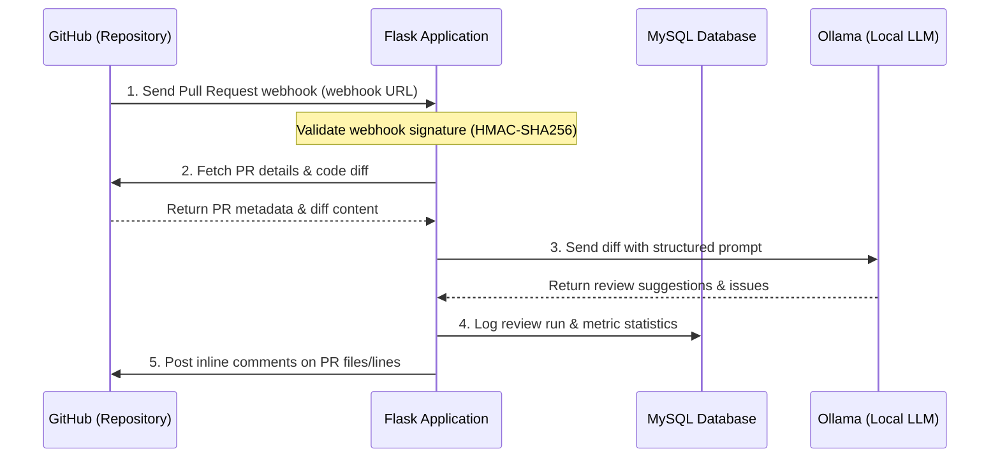

# AI Code Reviewer

An automated, production-grade AI-powered GitHub Code Review Assistant that integrates with GitHub Webhooks and utilizes Large Language Models (LLMs) to automatically analyze Pull Requests, detect bugs/vulnerabilities, post comments back to GitHub, and display analytics.

---

## 1. Project Overview
The **AI Code Reviewer** is a self-hosted, automated tool designed to optimize code quality assurance and accelerate development cycles. By receiving real-time webhook events from GitHub, the service automatically clones or fetches the relevant Pull Request diff, runs static and AI-based analysis using local LLMs (powered by Ollama), and writes contextual comments, suggestions, and warnings directly onto the relevant lines of code in the GitHub PR interface. Historical metrics are persisted in a relational database, supporting a built-in dashboard for team-wide review analytics.

---

## 2. Project Objectives
* **Automated Code Auditing**: Provide instantaneous feedback on Pull Requests regarding code smells, bugs, syntax issues, and performance bottlenecks.
* **Security & Compliance**: Detect security vulnerabilities (e.g., SQL injection, hardcoded secrets, cross-site scripting) using tailored AI instructions.
* **Feedback Loop Integration**: Post review comments back to the exact files and lines of code in the GitHub PR interface.
* **Local AI Execution**: Support running models locally (via Ollama) to keep intellectual property and source code completely private.
* **Review Analytics**: Record code review results, allowing teams to track bug rates, code health trends, and average response times.

---

## 3. End-to-End Workflow


---

## 4. Technology Stack

| Layer | Component | Details |
| :--- | :--- | :--- |
| **Backend Framework** | Python / Flask | Modular setup with the Application Factory pattern |
| **Database ORM** | SQLAlchemy 2.0 | High-performance ORM interacting with MySQL |
| **Production Server** | Gunicorn | WSGI HTTP Server for production deployment |
| **Authentication/API** | PyJWT / Requests | JWT generation & verification for GitHub App integration |
| **Database** | MySQL | Relational database to persist metadata, review history, and metrics |
| **AI Inference Engine** | Ollama | Run local LLMs (`codellama:python` base; support for Llama 3, Qwen, Mistral) |
| **Frontend** | HTML, CSS, Bootstrap, Chart.js | Responsive administration & metrics analytics dashboard |
| **Deployment** | Docker & Docker Compose | Containerized system with Nginx reverse proxy |
| **CI/CD & Cloud** | GitHub Actions / AWS | CI pipelines and AWS hosting architecture |

---

## 5. Current Folder Structure
```
ai-code-reviewer/
├── agents/                     # Directory for agent configuration and guidelines
│   ├── CLAUDE.md
│   ├── GEMINI.md
│   ├── CHATGPT.md
│   └── RULES.md
├── app/                        # Application source directory
│   ├── api/
│   │   └── v1/
│   │       ├── analytics.py    # Analytics endpoints (stats, metrics)
│   │       └── webhooks.py     # GitHub Webhook handler
│   ├── models/                 # SQLAlchemy database models
│   ├── services/               # Services for GitHub operations, Ollama prompts
│   ├── static/                 # Static CSS, JS, and image assets
│   ├── templates/              # HTML frontend templates
│   ├── extensions.py           # Database (db) and extension instantiations
│   └── __init__.py             # Flask App creation factory
├── docs/                       # Project reference documentation
│   ├── ARCHITECTURE.md
│   ├── CHANGELOG.md
│   ├── DATABASE.md
│   ├── PROJECT.md              # (This File)
│   └── ROADMAP.md
├── prompts/                    # Reusable prompting template library
│   ├── bugfix.md
│   ├── feature.md
│   ├── implementation.md
│   ├── refactor.md
│   └── review.md
├── scripts/                    # Utilities and automated setup tasks
├── tests/                      # Unit and integration tests
├── config.py                   # Configuration environments (Dev, Production)
├── requirements.txt            # Python dependencies manifest
├── setup_workspace.py          # Workspace setup automator
└── wsgi.py                     # Entrypoint script for WSGI servers
```

---

## 6. Software Architecture
The application is structured into distinct layers to maintain separation of concerns:
1. **Presentation / Routing Layer**: Flask blueprints inside `app/api/v1/` route incoming HTTP requests. They parse parameters and handle serialization.
2. **Service Layer**: Classes inside `app/services/` handle interactions with the GitHub API (fetching diffs, posting comments) and Ollama (managing prompts, executing model runs).
3. **Data Access Layer**: Database schemas and operations are modeled using SQLAlchemy 2.0 inside `app/models/`, leveraging the Flask-SQLAlchemy extension.
4. **Configuration Layer**: Centrally loaded settings using `.env` files in `config.py` using subclass-based environments (Development, Production).

---

## 7. Coding Standards
* **Python Compliance**: Follow PEP 8 guidelines. Document all functions and classes using clean docstrings.
* **Factory Pattern**: Do not bind global extensions directly to the Flask app instance during initialization. Keep the App Factory flexible.
* **SQLAlchemy 2.0**: Use modern SQLAlchemy patterns (such as typing, DeclarativeBase, select statements). Avoid legacy SQL expressions.
* **Security Practices**: Verify all incoming GitHub webhook payloads with HMAC-SHA256 signature verification. Never store private tokens or credentials in version control.

---

## 8. Current Project Status
* [x] **Workspace Initialization**: Directory structure and virtual environment scaffolded.
* [x] **Flask Application Factory**: `create_app()` implemented in `app/__init__.py`.
* [x] **Configuration Layer**: Development and production environments configured via environment variables.
* [x] **Base Routing**: Webhook and analytics blueprints created and registered.
* [x] **Health Check**: `/health` endpoint fully functional.
* [ ] **Database & Models**: Schema definitions, migration steps, and ORM mapping to be implemented.
* [ ] **GitHub Webhook Verification**: Integrity check logic to be added.
* [ ] **Ollama Client Integration**: Prompts, payloads, and response parsing.

---

## 9. Development Roadmap

### Phase 1: Database & Core Models
* Define relational schema for review records, files reviewed, and metrics.
* Integrate SQLAlchemy ORM with Flask application contexts.
* Establish schema migration support.

### Phase 2: GitHub Webhook Validation & PR Parser
* Implement HMAC webhook verification using signature headers.
* Extract code diffs and commit hashes from incoming pull request event payload.
* Parse unified diff format into file-based, line-indexed chunks.

### Phase 3: Ollama Integration & Prompt Library
* Build integration services with local Ollama daemon.
* Structure and write modular markdown prompts for different review types.
* Process code chunks through LLM and compile returned feedback.

### Phase 4: Feedback Dispatcher & Dashboard UI
* Add service logic to publish inline PR comments on GitHub.
* Develop a browser-based analytics dashboard showing charts of detected issues, review volume, and repository performance.
* Design CSS layout for metrics display.

---

## 10. AI Assistant Workflow
The AI Assistant references configuration patterns defined in `agents/` and files within `prompts/` to execute tasks:
1. **Behavior Verification**: Reads context files (`agents/CLAUDE.md`, etc.) to align style and operating guidelines.
2. **Context Intake**: Gathers task scope (e.g. standard implementation vs. critical bugfix).
3. **Template Resolution**: Selects matching prompt markdown from `prompts/` directory to structure the final LLM payload.
4. **Execution & Log**: Performs local Ollama queries and documents findings.

---

## 11. Engineering Rules
* **No Hardcoded Secrets**: All keys, passwords, and API credentials must reside in `.env` files.
* **Test Before Merge**: Write unit/integration tests for new features and verify using `pytest` to prevent regressions.
* **Graceful Degradation**: Handle API failures or network errors gracefully with retry strategies and comprehensive logging.

---

## 12. Future Scope
* **Multi-model Orchestration**: Automatically route files or chunks to different local models based on complexity or file language.
* **Custom Rules Engines**: Let developers specify custom project rules in a configuration file (e.g., `rules.yaml`) which is dynamically injected into prompts.
* **IDE Integrations**: Create local browser or editor extensions that display analytics and inline reviews directly in the workspace.
